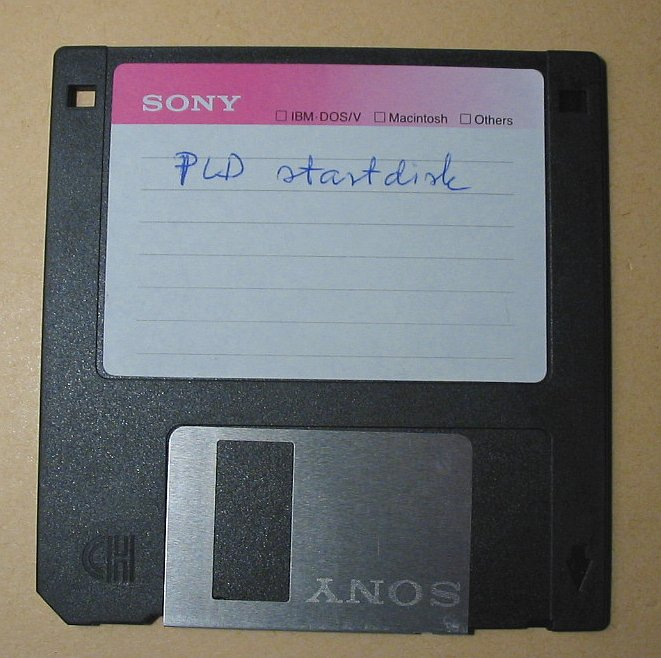
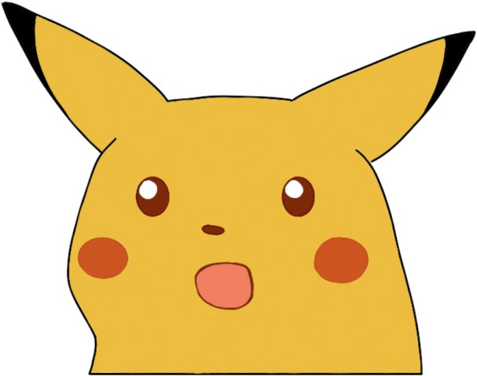
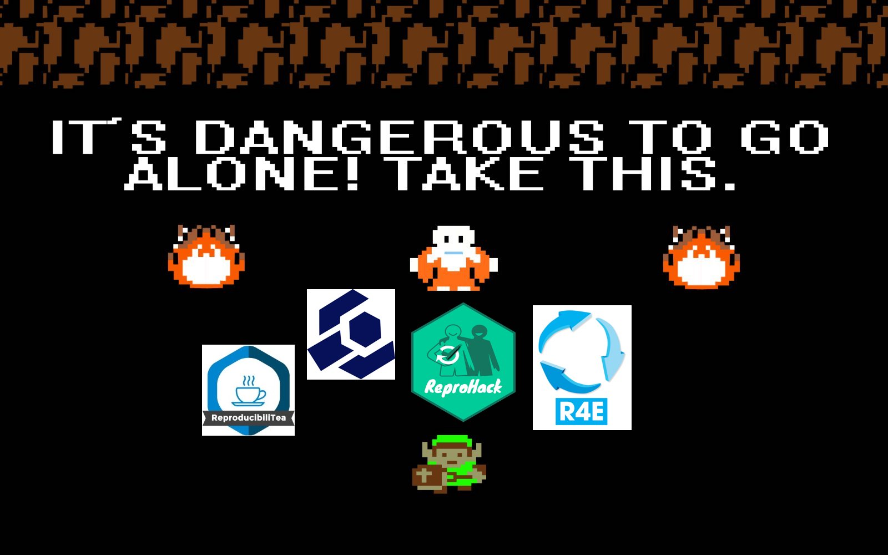
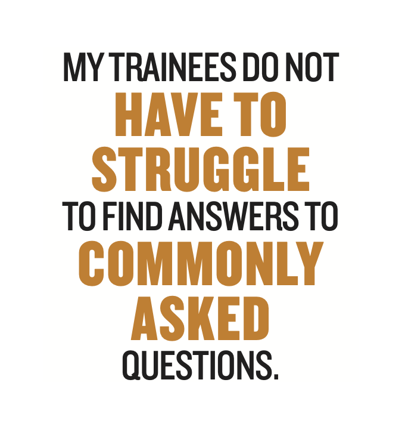

```{r setup, include=FALSE}
options(htmltools.dir.version = FALSE)
```

```{r xaringan-themer, include=FALSE, warning=FALSE}
library(xaringanthemer)
style_duo_accent(
  primary_color = "#5C2443", 
  secondary_color = "#1B345C", 
  base_font_size = "28px", 
  header_h1_font_size = "2.0rem",
  header_h2_font_size = "1.5rem",
  header_h3_font_size = "1.25rem", 
  header_background_content_padding_top = "2rem", 
  header_font_google = google_font("Lato"),
  text_font_google   = google_font("Montserrat", "300", "300i", "500"),
  code_font_google   = google_font("Source Code Pro", "300", "500"), 
  extra_css = list("p" = list("margin-block-start" = "0.5em", 
                              "margin-block-end" = "0.5em"), 
                   "ul" = list("margin-block-start" = "0.5em", 
                              "margin-block-end" = "0.5em"), 
                   "li" = list("margin-block-start" = "0.5em", 
                              "margin-block-end" = "0.5em"), 
                   "pre" = list("margin-top" = "0.5em", 
                              "margin-bottom" = "0.5em"), 
                   "h1" = list("margin-block-start" = "1em", 
                              "margin-block-end" = "1em"),
                   "h3" = list("margin-block-start" = "0.5em", 
                              "margin-block-end" = "0.5em"), 
                   "h4" = list("margin-block-start" = "0.5em", 
                               "margin-block-end" = "0.5em"), 
                   ".large" = list("font-size" = "125%"), 
                   ".small" = list("font-size" = "80%"), 
                   ".tiny" = list("font-size" = "50%"),
                   ".bg-blue1" = list("background-color" = "#1B345C", 
                                      "color" = "#FFFFFF"), 
                   ".bg-blue2" = list("background-color" = "#1E3B69", 
                                      "color" = "#FFFFFF"),
                   ".bg-blue3" = list("background-color" = "#315FA8", 
                                      "color" = "#FFFFFF"),
                   ".w40" = list("width" = "40%"), 
                    ".w60" = list("width" = "60%")), 
  link_color = "#F06C77", 
  outfile = "hao-theme.css"
)
```

class: inverse, center, middle

# `r rmarkdown::metadata$title`

.pull-left.w40[
### `r rmarkdown::metadata$author`
#### `r rmarkdown::metadata$institute`
```{r, echo = FALSE, out.width = "7%", collapse = TRUE}
#| fig.alt = "Twitter logo"

```
[@Hao_and_Y](https://twitter.com/Hao_and_Y)
]

.pull-right.w60[
### Research Reproducibility:<br />Engaging Across Disciplines
#### 2021, November 3
]

---

# Preliminaries

In this talk, I will refer to the open and reproducible research ecosystem as **open science**.
  - This is inaccurate, because there are many disciplines that exist outside of science.

---
# Roadmap?

```{r, echo = FALSE, out.width = "90%", collapse = TRUE}
#| fig.alt = "Stylized art of a man in a purple suit jacket and a woman with red shirt and gray skirt looking at a map with directions and standing outside a hedge maze."

```

???

I wish I could say that I have a straightforward plan, but that would be a lie.

---
layout: true
class: split-three

.row.bg-blue1[.content[
.large[Researchers ask different questions and solve different problems.]
]]
.row.bg-blue2[.content[
.large[Researchers have different approaches, methods, and modes of work.]
]]
.row.bg-blue3[.content[
.large[There is no one-size-fits-all solution!]
]]

---
class: show-100
---
class: show-110
count: false
---
count: false

???

So what does this mean?
---
layout: false
# Open Science is a buffet

.center[
<blockquote class="twitter-tweet"><p lang="en" dir="ltr">So glad the buffet metaphor is catching on, there are so many solutions out there. Don&#39;t try to stuff yourself on everything, select what works for this study and let&#39;s steadily improve our fields... <a href="https://twitter.com/hashtag/openscience?src=hash&amp;ref_src=twsrc%5Etfw">#openscience</a> <a href="https://t.co/QrtqMa6HHM">https://t.co/QrtqMa6HHM</a></p>&mdash; Dr. Christina Bergmann (@chbergma) <a href="https://twitter.com/chbergma/status/1104338904646385665?ref_src=twsrc%5Etfw">March 9, 2019</a></blockquote> <script async src="https://platform.twitter.com/widgets.js" charset="utf-8"></script>
]

???

Open Science is a buffet. There are many skills you can learn, actions you can take, ways of thinking you can adopt.

Let me tell you a little bit about how I think about it.

---
# What I Care About

1. All components of research should be transparent and documented (as much as possible).
2. All contributions to a project should be recognized and rewarded. (e.g. data sources, data collection, software, methods development, etc.)

--

.center[**I work to to dismantle barriers to participation in scholarship.**]

---
# The Rest of the Talk

1. How to think about reproducibility
2. Ways to engage with reproducibility
3. Resources for taking initial steps

???

Researchers are not monolithic! We all have different starting points, different goals that we strive for, and different preferred approaches for reaching those destinations.

---
class: inverse, center, middle

# Principles for thinking about reproducibility

---
class: center, middle

# "The core of open science is radical transparency."
## Vicky Rampin

???

Good and accurate documentation is important! Here's my own personal story where I learned the importance of good documentation.

---
layout: true
class: split-three with-thick-border middle

.column.bg-main1[.content.vmiddle[
```{r, echo = FALSE, collapse = TRUE}
#| fig.alt = "The original Macintosh personal computer. It is a yellow-beige box with a small rectangular screen and 3.5 inch floppy-disk drive slot on the front surface. The screen is on, and shows the grayscale interface of the Macintosh operating system."
knitr::include_graphics("images/macintosh.png")
```
]]
.column.bg-main2[.content.vmiddle[
    
]]
.column.bg-main3[.content.vmiddle[
```{r, echo = FALSE, collapse = TRUE}
#| fig.alt = "Surprised Pikachu face. A yellow pokemon with sharp ears tipped in black and red cheeks has its mouth open in a look of surprise."

```
]]

---
class: show-000
---
class: show-100
count: false
---
class: show-110
count: false
---
count: false
---
layout: false
# Metadata

**metadata** - data that describes other data.

### Accurate metadata is important!

Datafiles should have documentation that describe:
* which project the data is for
* who/what/when/where/how the data were collected
* data structure, measurement units, etc.

???

How do you think about principles for documenting and sharing research works?

---
# FAIR

FAIR principles were originally intended for scientific data [Wilkinson et al. 2016](https://www.nature.com/articles/sdata201618)

* Findable
* Accessible
* Interoperable
* Reusable
--

* Equitable

???
I'm going to make two modifications - extending these principles to research outputs broadly defined.
And including Equitable

---
# Findable

* Does the research object have a unique DOI (separate from the publication it might be associated with)?
* Does the description include information about the authors, the associated publications, and funding sources?
* Does the description follow community standards for keywords, tags, etc.?


---
# Accessible

* Is the research object retrievable? (Does the DOI link work?)
  - By anyone, or with appropriate permissions if the content is restricted/sensitive.
* Is the research object on an available platform? (a standard repository)


---
# Interoperable

* Is the research object in a open format?
  - e.g. CSV for tabular data
* Does computer code run on open (non-proprietary) systems/platforms?
* Are materials 

---
# Reusable

* Is the research object being shared in a form that is usable by others?
  - The raw version of data (for auditing) and the cleaned version (for analysis)
  - For code, installation instructions and defining dependencies
  - For methods and protocols, sufficient detail about procedures and materials (e.g. RRID)

---
# Equitable

* Was the data collected ethically (e.g. with consent, stakeholder participation, etc.)?
* Is the research object shared following ethical principles? (being mindful of PII, potential harmful impacts, etc.)

---
class: inverse, center, middle

# Getting Started

---
# Research Activities are very diverse

There are both accepted and ongoing work to bring openness and reproducibility to different aspects of research, including:
* research design
* data
* code, analysis, methods
* publications

---
# Materials

Reproducibility 4 Everyone
The Carpentries

---
# 

```{r, echo = FALSE, collapse = TRUE}
#| fig.alt = "asdf"

```


---
# University Research Support

* Librarians
* Office Sponsored Research
* Research Integrity / Compliance Office 
* Data Management, Research Software Engineering, Research Computing

---
# Learning Communities

* You can learn and grow in a group.  
  You don't have to do everything yourself!
* A group provides social norms and accountability.  
  Dedicated time/space for learning, and goal-setting.
* Communities do not have be about reproducibility!  
  Learning skills or specific tools is helpful, too.

---
# ReproducibiliTea Journal Club


---
# The Carpentries

---
# R4DS Online Community


---
# Reproducibility 4 Everyone


---
class: center, middle

# What about culture change?

---

# Creating Change

An **open, reproducible research ecosystem** requires culture change. How can individual researches push things along?

---
# Identify your power/privilege

Everyone has *different* capabilities to engage in change

* job precarity
* opportunity cost for learning new skills
* tradeoffs with deviating from status quo
* academic status, power, positions
* biases and prejudice

---

Where do you have influence?

Where can you find allies?
  - shared values and working towards a common vision
  - shared objective and you can achieve a win-win outcome

---
# Lab Manuals

* Share institutional/organizational knowledge
* Reduced barriers for academic "Hidden Curriculum"



.small[ -Mariam Aly <br /> https://www.nature.com/articles/d41586-018-06167-w]

---
# Creating a Lab Manual

* [template]


---
# Finding more power

.center[*If the problem is limited power, then the answer is to acquire more power.*]

--

~~Become a supervillain~~

--

**Collective action is a solution to limited individual power.**

---
# Implementation Actions

Different levels of scale
* personal -> lab group -> field / professional society -> all of research
---
# Avenues for Advocacy

* Professional Societies (e.g. SIPS)
* Journals
* Other groups (e.g. FORRT, SORTEE)

Guiding Questions:
* Are they creating standards?
* Are the standards clear, verifiable, and enforced?

---


"Open source practices can shift power" - Abigail Cabunoc Mayes

---


---

---

# What do you want to achieve?

* Mastering skills and tools for reproducibility
* Creating work that anyone can reproduce
* Reproducibility as a career requirement (funding, publication, jobs)

---

Target specific skills and tools to learn and practice.

Identify goals, and develop a plan. 

Work from standards or help create standards


---
# Thanks


---
# A Personal Story

Once upon a time, I tried to replicate the results in a (computational) paper.

1. I contacted the authors and received some information about parameter values and software used, but not the full data or code.
2. After failing to replicate the results, my research group identified other issues with the results.
3. We wrote up our findings, but were unable to get it published in the original venue.

---

# Lessons Learned

* replicating papers is a lot of work (even when it requires no new experiments or data collection)
* not having data and code is a huge waste of time
* it is difficult to get replications published - journals, editors, and publishers are not always motivated

