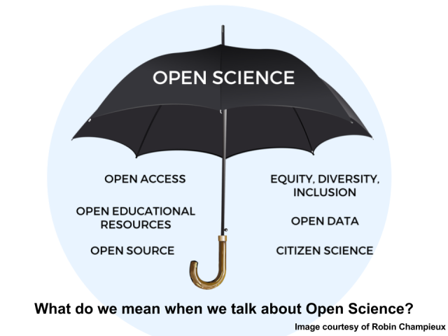

```{r setup, include=FALSE}
options(htmltools.dir.version = FALSE)
```

```{r xaringan-themer, include=FALSE, warning=FALSE}
library(xaringanthemer)
style_duo_accent(
  primary_color = "#5C2443", 
  secondary_color = "#1B345C", 
  base_font_size = "28px", 
  header_h1_font_size = "2.0rem",
  header_h2_font_size = "1.5rem",
  header_h3_font_size = "1.25rem", 
  header_background_content_padding_top = "2rem", 
  header_font_google = google_font("Lato"),
  text_font_google   = google_font("Montserrat", "300", "300i", "500"),
  code_font_google   = google_font("Source Code Pro", "300", "500"), 
  extra_css = list("p" = list("margin-block-start" = "0.5em", 
                              "margin-block-end" = "0.5em"), 
                   "ul" = list("margin-block-start" = "0.5em", 
                              "margin-block-end" = "0.5em"), 
                   "li" = list("margin-block-start" = "0.5em", 
                              "margin-block-end" = "0.5em"), 
                   "pre" = list("margin-top" = "0.5em", 
                              "margin-bottom" = "0.5em"), 
                   "h1" = list("margin-block-start" = "1em", 
                              "margin-block-end" = "1em"),
                   "h3" = list("margin-block-start" = "0.5em", 
                              "margin-block-end" = "0.5em"), 
                   "h4" = list("margin-block-start" = "0.5em", 
                               "margin-block-end" = "0.5em"), 
                   ".large" = list("font-size" = "125%"), 
                   ".small" = list("font-size" = "80%"), 
                   ".tiny" = list("font-size" = "50%"),
                   ".bg-blue1" = list("background-color" = "#1B345C", 
                                      "color" = "#FFFFFF"), 
                   ".bg-blue2" = list("background-color" = "#1E3B69", 
                                      "color" = "#FFFFFF"),
                   ".bg-blue3" = list("background-color" = "#315FA8", 
                                      "color" = "#FFFFFF"),
                   ".w40" = list("width" = "40%"), 
                    ".w60" = list("width" = "60%")), 
  link_color = "#F06C77", 
  outfile = "hao-theme.css"
)
```

class: inverse, center, middle

# `r rmarkdown::metadata$title`

.pull-left.w40[
### `r rmarkdown::metadata$author`
#### `r rmarkdown::metadata$institute`
```{r, echo = FALSE, out.width = "9%", collapse = TRUE}
#| fig.alt = "Twitter logo"
knitr::include_graphics("images/twitter_logo_blue.svg")
```
[@Hao_and_Y](https://twitter.com/Hao_and_Y)
]

.pull-right.w60[
### Research Reproducibility:<br />Engaging Across Disciplines
#### 2021, November 3
]

---

# Preliminaries

I will refer to the open and reproducible research ecosystem as **open science**.
  - This is inaccurate, because there are many disciplines that exist outside of science.

---
class: center, middle

```{r, echo = FALSE, out.width = "100%", collapse = TRUE}
#| fig.alt = "Twitter logo"

```

---
# Roadmap?

```{r, echo = FALSE, out.width = "90%", collapse = TRUE}
#| fig.alt = "Stylized art of a man in a purple suit jacket and a woman with red shirt and gray skirt looking at a map with directions and standing outside a hedge maze."
knitr::include_graphics("images/maze.png")
```

???

I wish I could say that I have a straightforward plan or a simple technological solution, but this isn't a TED talk, and I'm not trying to sell you anything.

---
layout: true
class: split-three

.row.bg-blue1[.content.vmiddle[
.large[Researchers ask different questions and work on different problems.]
]]
.row.bg-blue2[.content.vmiddle[
.large[Researchers have different approaches, methods, and modes of working.]
]]
.row.bg-blue3[.content.vmiddle[
.large[There is no one-size-fits-all solution!]
]]

---
class: show-100
---
class: show-110
count: false
---
count: false

???

So what does this mean?
---
layout: false
# Open Science is a buffet

.center[
<blockquote class="twitter-tweet"><p lang="en" dir="ltr">So glad the buffet metaphor is catching on, there are so many solutions out there. Don&#39;t try to stuff yourself on everything, select what works for this study and let&#39;s steadily improve our fields... <a href="https://twitter.com/hashtag/openscience?src=hash&amp;ref_src=twsrc%5Etfw">#openscience</a> <a href="https://t.co/QrtqMa6HHM">https://t.co/QrtqMa6HHM</a></p>&mdash; Dr. Christina Bergmann (@chbergma) <a href="https://twitter.com/chbergma/status/1104338904646385665?ref_src=twsrc%5Etfw">March 9, 2019</a></blockquote> <script async src="https://platform.twitter.com/widgets.js" charset="utf-8"></script>
]

???

Open Science is a buffet. There are many skills you can learn, actions you can take, ways of thinking you can adopt.

Let me tell you a little bit about how I think about it.

---
# What I Care About

1. **Openness**  
  Everything should be open, transparent, and documented (as much as possible).
2. **Recognition**  
  All the work in all the facets of research should be recognized and rewarded. (e.g. data sources, data collection, software, methods development, etc.)

--

****

.center[**Remove barriers to participate in open science.**]

???

I think these are just the core ideas of good scholarship, typically thought of in citation terms, but applied broadly.

---
# The Rest of the Talk

1. Documentation
2. How to think about working open
3. Resources for taking initial steps

???

Researchers are not monolithic! We all have different starting points, different goals that we strive for, and different preferred approaches for reaching those destinations.

---
class: inverse, center, middle

# The Importance of Being ~~Earnest~~ Radically Transparent

???

In practice, this means good and accurate documentation. So let me tell you how I learned the importance of good documentation.

---
layout: true
class: split-three middle

.column.bg-main1[.content.vmiddle[
```{r, echo = FALSE, collapse = TRUE}
#| fig.alt = "The original Macintosh personal computer. It is a yellow-beige box with a small rectangular screen and 3.5 inch floppy-disk drive slot on the front surface. The screen is on, and shows the grayscale interface of the Macintosh operating system."
knitr::include_graphics("images/macintosh.png")
```
]]
.column.bg-main2[.content.vmiddle[
    
]]
.column.bg-main3[.content.vmiddle[
```{r, echo = FALSE, collapse = TRUE}
#| fig.alt = "Surprised Pikachu face. A yellow pokemon with sharp ears tipped in black and red cheeks has its mouth open in a look of surprise."
knitr::include_graphics("images/surprised_pikachu.png")
```
]]

---
class: show-000
---
class: show-100
count: false
---
class: show-110
count: false
---
count: false
---
layout: false
# Good documentation saves time!

Documentation requires initial time investment, but saves time later.
* answering questions
* onboarding new people
* creating shared knowledge

???

One of my favorite examples of a practice in good documentation is the Lab Manual.
---
# Lab Manuals

* A repository of institutional/organizational knowledge
* Lab practices, academic culture, campus resources, logistical information

.center[
*-Mariam Aly* <br /> .small[https://www.nature.com/articles/d41586-018-06167-w]]

---
## Basic Elements of Lab Manuals
(via [Samuel Mehr](https://twitter.com/samuelmehr/status/1139733291899080705))

.pull-left.small[
* Mission Statement
* Roles and Expectations
* Open Science
* Communication
* Logistics
* Internal Resources
* External Resources
* Onboarding
* Recurring Events
* Day-to-day
* Behavior
]
.pull-right.small[
* Ethics and Safety
* Engagement
* How to Run Experiments
* Data Analysis
* Publications & Authorship
* Conferences
* Money
* Offboarding
* Mentorship and Development
* What to do if you need help
* Reading list
]

???

Similar content as an employee handbook.

---
# Why

1. It saves time in answering questions
2. Accepting updates/contributions from lab members promotes community
3. People have different backgrounds, experiences, and may not be familiar with norms in your organization. **#HiddenCurriculum**

---
class: inverse, center, middle

# Principles for Working Open

---
# FAIR

FAIR principles were originally intended for scientific data [Wilkinson et al. 2016](https://www.nature.com/articles/sdata201618)

* Findable
* Accessible
* Interoperable
* Reusable
--

* Equitable

???
I'm going to make two modifications - extending these principles to research outputs broadly defined.
And including Equitable

---
# Findable

* Does the research object have a unique DOI (separate from the publication it might be associated with)?
* Does the description include information about the authors, the associated publications, and funding sources?
* Does the description follow community standards for keywords, tags, etc.?


---
# Accessible

* Is the research object retrievable? (Does the DOI link work?)
  - By anyone, or with appropriate permissions if the content is restricted/sensitive.
* Is the research object on an available platform? (a standard repository)


---
# Interoperable

* Is the research object in a open format?
  - e.g. CSV for tabular data
* Does computer code run on open (non-proprietary) systems/platforms?

---
# Reusable

* Is the research object being shared in a form that is usable by others?
  - The raw version of data (for auditing) and the cleaned version (for analysis)
  - For code, installation instructions and defining dependencies
  - For methods and protocols, sufficient detail about procedures and materials (e.g. RRID)
* Does the research object have a license that enables reuse?

---
# Equitable

* Was the data collected ethically (e.g. with consent, stakeholder participation, etc.)?
* Is the research object shared following ethical principles? (being mindful of PII, potential harmful impacts, etc.)

---
## Is the Lab Manual FAIRE?

**Findable**  
Is there a link on the lab website?

**Accessible**  
Does the link resolve to the correct document?

**Interoperable**  
Is it easy to navigate, and make edits to?

**Reusable**  
Are other labs able to make derivative works?

**Equitable**  
Does the lab manual contain info for marginalized groups (e.g. LGBTQ, international students, disabilities)?


---
class: inverse, center, middle

# Getting Started

---
# Research Activities

.center[*{insert "Research Cycle" graphic of your choice}*]

There are many different aspects of research that could be more open and reproducible:
* research design
* data collection and management
* experimental methods
* computer code and analysis
* publications

???

It may seem like there are many options, and you have decision paralysis, and that you have to do everything on your own, but that isn't the case!

---
```{r, echo = FALSE, collapse = TRUE}
#| fig.alt = "Adapted image from The Legend of Zelda. A pixelated video game screenshot shows a bearded wiseman in a cave surrounded by magical fire on the left and right telling the hero: 'It's dangerous to go alone! Take This.' Instead of a sword, the hero is holding up the logos for ReproducibiliTea, The Carpentries, ReproHack, and R4E."

```

---
# Existing University Support Structures

* Librarians
* Office Sponsored Research
* Research Integrity / Compliance Office 
* Data Management, Research Software Engineering, Research Computing

---
# Learning Communities

* You can learn and grow in a group.  
  You don't have to do everything yourself!
* Learning a new skill takes time and practice.  
  A group provides social norms and accountability, with dedicated time/space for practice.

???
short-form interventions (like bootcamps) aren't sufficient on their own

---
# Core Skills

** [The Carpentries](https://carpentries.org/)**  
  Workshops for essential data and computational skills
    
** [Reproducibility 4 Everyone](https://repro4everyone.org/)**  
  Workshops for reproducible research practices
    
** [TidyTuesday](https://github.com/rfordatascience/tidytuesday)**  
  Weekly event from the R4DS Online Learning Community to practice data wrangling and data visualization.

---
# Mentored Experiences

Cohort-based programs with individual and group mentorship.

** [OpenScapes]()**  
  5-month Champions program for lab groups.
  
** [Open Life Science](https://openlifesci.org/)**  
  16-week program for individuals or small group projects (open-science related).

???

That's a lot of time! 

---
layout: false
class: inverse, center, middle

# What about culture change?

---

# Creating Change

An **open, reproducible research ecosystem** requires culture change. How can individual researches push things along?

---
# Identify your power/privilege

Everyone has *different* capabilities to engage in change

* job precarity
* opportunity cost for learning new skills
* tradeoffs with deviating from status quo
* academic status, power, positions
* biases and prejudice

???
If the problem is limited power, then the answer is to acquire more power.
No, don't become a supervillain.
**Collective action is a solution to limited individual power.**

---

### Where do you have influence?
  - in your lab
  - in your department
  - in your professional society

### Where can you find allies?
  - shared values and working towards a common vision
  - shared objective and you can achieve a win-win outcome

---
# Reproducibility Affinity Groups

** [ReproducibiliTea](https://reproducibilitea.org/)**  
  Globally-distributed, local journal club chapters to discuss open science and reproducibility
  
** [ReproHack](https://www.reprohack.org/)**  
  Hackathons to practice reproducing published research  
  [Nov 18. launch of ReproHack Hub](https://www.reprohack.org/event/11/)

** [BITSS](https://www.bitss.org/)**  
  Berkeley Initiative for Transparency in the Social Sciences

---
# Research Software Affinity Groups

** [PyOpenSci](https://www.pyopensci.org/)**  
  Python packages for open and reproducible research
  
** [ROpenSci](https://ropensci.org/)**  
  R packages for open and reproducible research

** [Software Sustainability Institute](https://www.software.ac.uk/)**  
  Practices for better research software

---
# Advocacy Groups

** [SIPS](http://improvingpsych.org/)**  
  Society for the Improvement of Psychological Science
  
** [SORTEE](https://www.sortee.org/)**  
  Society for Open, Reliable, and Transparent Ecology and Evolutionary Biology

** [FORRT](https://forrt.org/)**  
  Framework for Open and Reproducible Research Training (embedding reproducibility in basic research training)

---
# Summary

1. There are many research activities to focus on. Pick one!
2. Document _everything_.
3. Find friends to learn together.
4. Bring allies to make culture change.

--
.center[
**"Open source practices can shift power"**

*- Abigail Cabunoc Mayes*
]

---